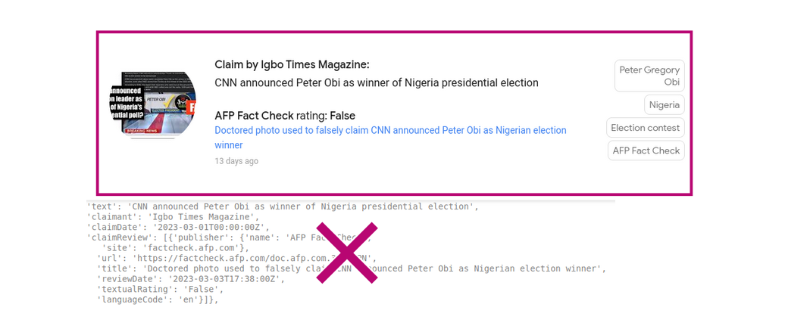

# Portfolio
---
## Skills

### Thematic Interests
political conflicts, hate speech, misinformation, political communication, social media, development, humanitarian aid

### Methodological Experiences
natural language processing, machine learning, deep learning, time-series modeling, causal inference

### Software Skills
Python (incl. PyTorch, Spark, NLTK, NetworkX, sklearn, SciPy, spaCy), R, Git, Linux, Tableau, PowerBI, KNIME

---
## Talks & Presentations

- Combating Online Misinformation at Scale @ World Bank in January 2024
- Stance Detection and Topic Modeling of Political Leaders' Public Communication on Climate Change @ MIT IDSS Conference in April 2023
- Political Leaders and Social Media Communication Across Regime Types @ Southern Political Science Association in January 2023
- Podcast Interview @ In Port and Learning in December 2022

---
## Research Papers

- Twitter and Leader
- Bot detection

---
## Projects

### Combating Online Misinformation at Scale: Developing Public Goods for Detecting and Testing Campaigns to Reduce Misinformation

Misinformation on social media platforms is rampant, from vaccine hesitancy to climate change. Policymakers and researchers regularly point to the lack of resources allocated by social media platforms to content moderation, especially in non-English languages and in the Global South, where independent fact-checking firms are also more rare. This creates a need to develop new public goods to detect misinformation on social media and to implement online interventions to reduce it. Jointly with colleagues at the World Bank, we are developing an ensemble approach to (1) identify false content, (2) identify propagators of false content, and (3) design interventions to combat the spread of misinformation.

**Claim Matching:** We identify social media posts that are semantically similar to fact-checked fake claims provided by organizations certified by the [International Fact-Checking Network](https://www.poynter.org/ifcn/).

**Topic Modeling:** As a diagnostic exercise we identify the topics amongst known fake claims via unsupervised topic modeling and analysis spatial and temporal deviances globally.

